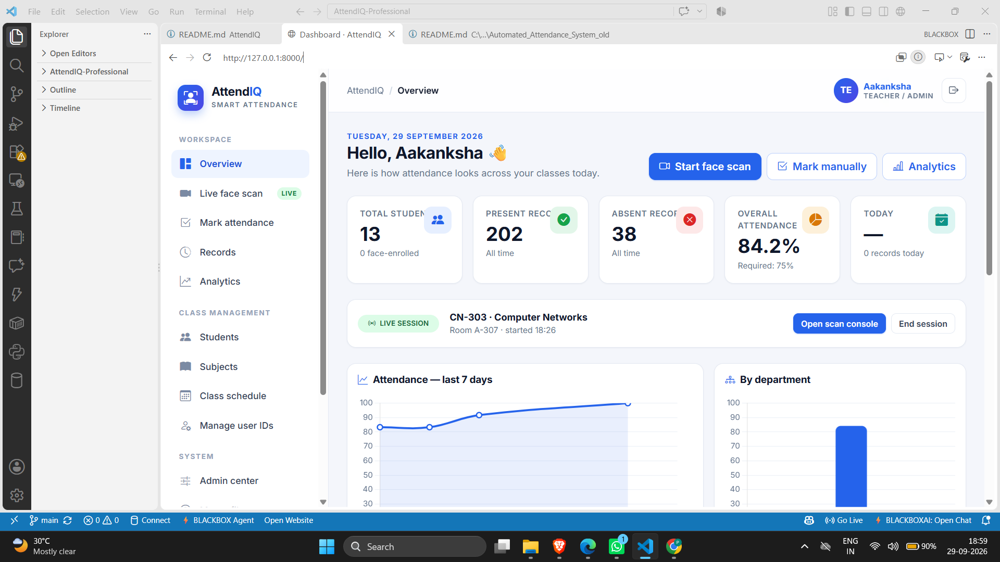
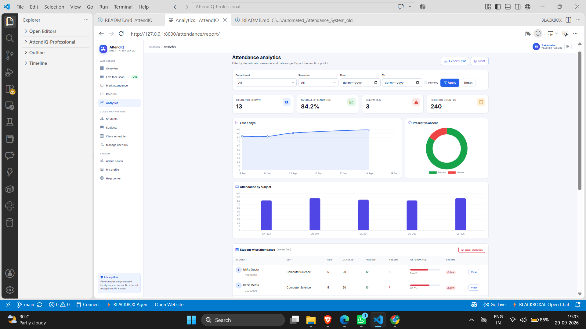
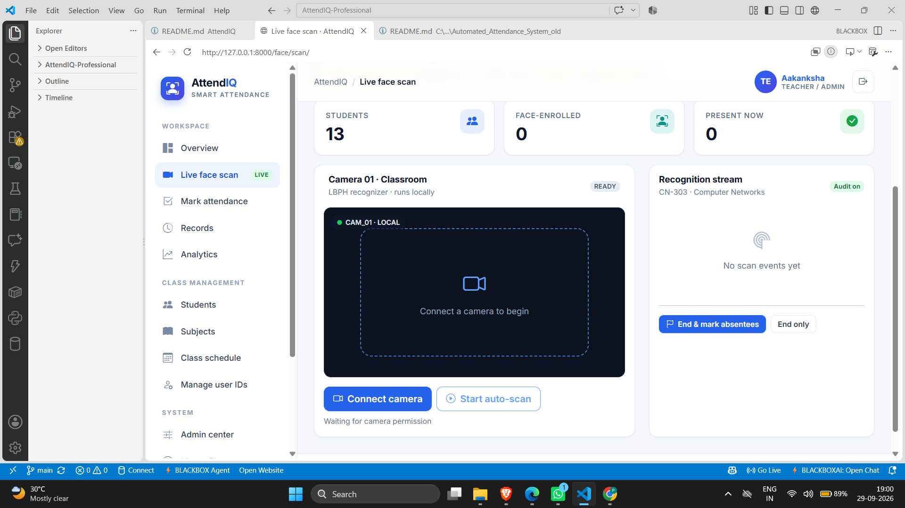
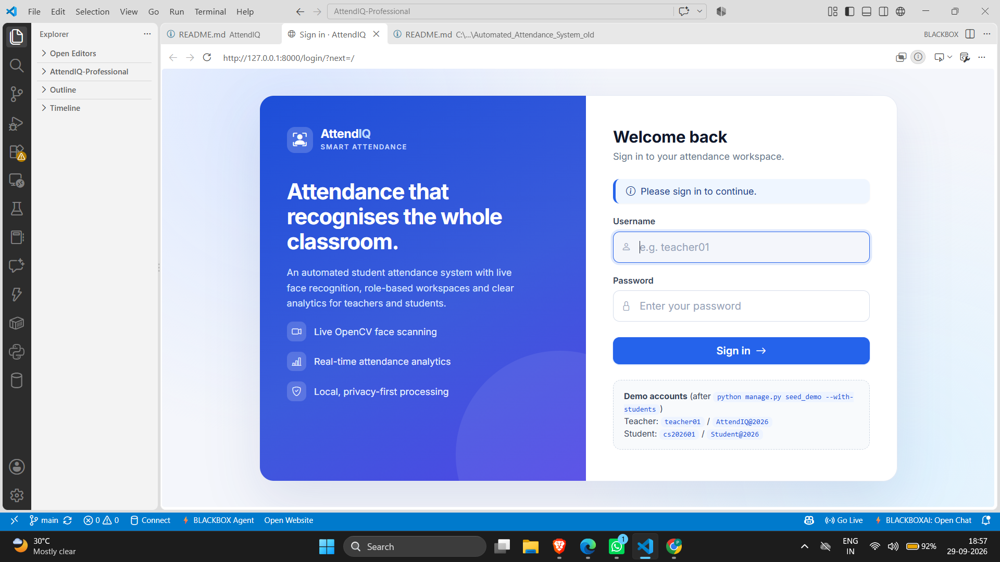
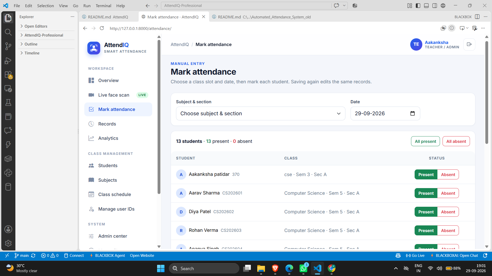
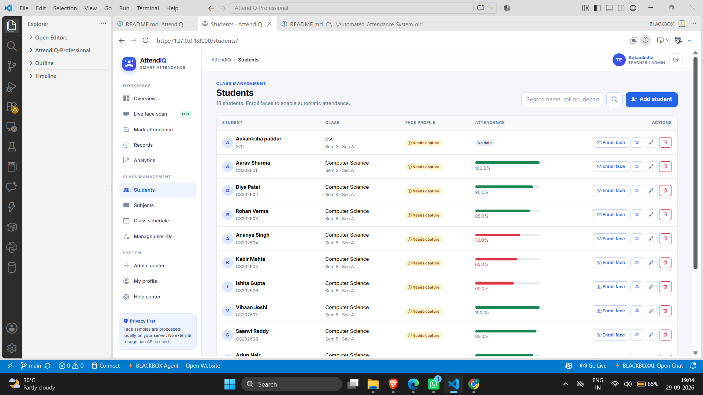
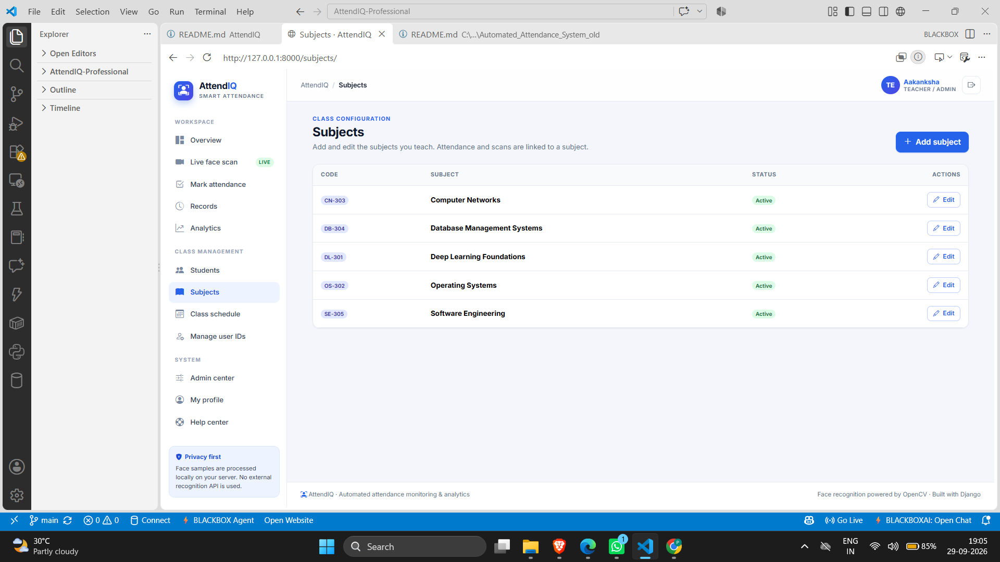
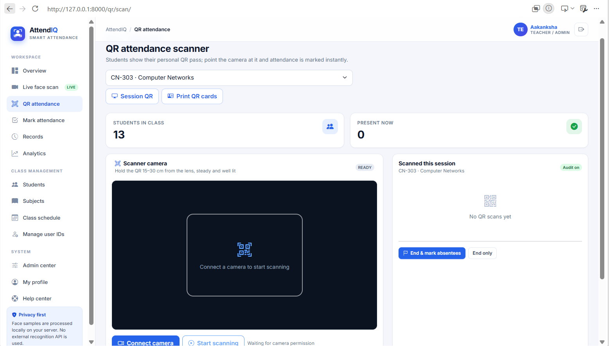

# AttendIQ — Automated Student Attendance Monitoring & Analytics System

A full-stack **Django** web application that automates classroom attendance using **live face recognition (OpenCV)**, with separate workspaces for **teachers** and **students**, analytics dashboards and audit-friendly records. All face processing runs locally — no external recognition API.

---

## Features

**Teacher / admin**
- Dashboard with KPIs, 7-day trend, department chart, low-attendance alerts and live-session status
- **Live face scan** — webcam frames are recognised on the server and attendance is logged once per session
- **QR attendance (two modes)** — scan student QR passes with a camera, or project a rotating class QR that students scan with their phones
- **Printable QR ID cards** for the whole class, and a personal *My QR pass* page for every student
- **End session & mark absentees** — students who were not scanned are recorded as absent automatically
- Manual attendance marking by subject / section / date (re-saving edits records, never duplicates them)
- Student management (add, edit, delete), face enrollment with automatic face-quality validation
- Subjects, weekly class schedule, student login management (rename / reset password)
- Analytics with department, semester and date filters, subject-wise chart, **CSV export** and **print** view
- Email warnings for students below 75 % (printed to the console in development)
- Django admin for full data control

**Student**
- Personal dashboard: attendance ring, present/absent counts, **subject-wise attendance**, low-attendance alert
- Full history filterable by date and subject — students can only see their own data

**Engineering quality**
- Role-based access control on every view; students cannot reach teacher pages, even by URL
- Input validation everywhere (dates, numbers, passwords via Django validators, duplicate roll numbers / subject codes)
- Trained face model is cached, so scanning stays fast; CSV export is protected against formula injection
- Automated test suite (`attendance/tests.py`), responsive light UI, environment-based configuration

## Tech stack

| Layer | Technology |
|---|---|
| Backend | Python 3.10+, Django 5.2 LTS |
| Face recognition | OpenCV (Haar cascade detection + LBPH recognizer), NumPy, Pillow |
| Frontend | Bootstrap 5.3, Bootstrap Icons, Chart.js 4, vanilla JavaScript |
| Database | SQLite (default; swappable in `settings.py`) |

## QR-code attendance

| Mode | Who scans | How it works |
|---|---|---|
| **A · Student pass** | Teacher's camera | Each student has a permanent, **digitally signed** QR (My QR pass, or a printed card). The teacher opens **QR attendance**, starts the camera, and each code shown is verified and marked present once per session. A typed roll number works as a fallback. |
| **B · Session QR** | Student's phone | The teacher opens **Session QR** on the projector. The code contains a **time-limited signed link** and refreshes every 30 s (valid 2 min). The student scans it with the phone camera, signs in, and is marked present. |

Security: signed payloads (Django `signing`) make forged QR codes useless; session tokens expire; a student is marked once per session; only students of the teacher's own class are accepted; every record stores its source (`qr`, `qr_self`, `qr_manual`) for auditing.

**Demo tip for Mode B (phones):** run `python manage.py runserver 0.0.0.0:8000`, open the Session QR page from your laptop using its Wi-Fi address (for example `http://192.168.1.20:8000/qr/session/`), and make sure phones are on the same Wi-Fi. QR images are generated and read with OpenCV — no extra library needed.

## How face recognition works

1. **Enrollment** — the teacher captures 3–12 webcam frames per student. Frames with no detectable face are rejected.
2. **Detection** — a Haar cascade finds the largest face; it is cropped, contrast-normalised and resized to 200×200.
3. **Recognition** — an LBPH (Local Binary Pattern Histogram) model is trained from the enrolled samples (and cached).
4. **Decision** — confidence ≥ 50 % → *matched* (attendance marked); 38–50 % → *needs review*; below 38 % → *unknown*. Every scan is stored as a `ScanEvent` for auditing.

There is **no bundled face dataset**: biometric data comes only from consenting students. Photos are stored in `media/face_samples/`.

## Setup

```bash
# 1.Clone repository 
git clone https://github.com/TechieAakanksha/AttendIQ.git
cd AttendIQ
# 2. Create and activate a virtual environment
python -m venv venv
# Windows:      venv\Scripts\activate
# macOS/Linux:  source venv/bin/activate

# 3. Install dependencies
pip install -r requirements.txt

# 4. Create the database and demo data
python manage.py migrate
python manage.py seed_demo --with-students

# 5. Run
python manage.py runserver
```

Open **http://127.0.0.1:8000/** (browsers only allow camera access on `localhost` or HTTPS).

### Demo logins
| Role | Username | Password |
|---|---|---|
| Teacher | `teacher01` | `AttendIQ@2026` |
| Student | `cs202601` | `Student@2026` |

`seed_demo` (without `--with-students`) creates only the teacher and subjects. `--with-students` also adds 12 students, a weekly timetable and four weeks of attendance history so the analytics are populated. Face samples are never faked — enroll real faces from **Students → Enroll face**.

To create your own administrator: `python manage.py createsuperuser`, then add a `Profile` with role *teacher* in `/admin/` (superusers are treated as teachers automatically).

## Testing

```bash
python manage.py check
python manage.py test
```

## Project structure

```
attendance_system/      Django project (settings, urls)
attendance/
  models.py             Profile, Subject, Student, CourseSession, TeachingAssignment, Attendance, FaceSample, ScanEvent
  views.py              All views (dashboard, students, attendance, analytics, face scan, ...)
  face_utils.py         OpenCV detection / LBPH recognition (with model cache)
  context_processors.py Navigation role flags
  management/commands/  seed_demo
  tests.py              Automated tests
templates/attendance/   HTML templates (light theme)
static/attendance/css/  style.css (design system)
```

## Screenshots










## Configuration & deployment notes

Development works with defaults. For any real deployment set:

```bash
DJANGO_SECRET_KEY="a-long-random-string"
DJANGO_DEBUG=0
DJANGO_ALLOWED_HOSTS="yourdomain.com"
```

Then run `python manage.py collectstatic`, serve with HTTPS behind a production server (gunicorn/uvicorn + nginx), use a production database, and change the demo passwords. The UI loads Bootstrap, icons, fonts and Chart.js from CDNs, so an internet connection is needed on first load.

## Limitations & future work

- LBPH is lightweight and works well for small classes under decent lighting; larger deployments should move to embedding models (FaceNet/ArcFace) and add liveness detection against photo spoofing.
- Encrypt face images at rest, add retention limits and consent records for production use.
- Ideas: SMS/WhatsApp alerts, REST API + mobile app, multi-camera support, PDF reports, GPS/Wi-Fi geofencing for session QR.

## Privacy

Only enroll students who have given informed consent. Face data never leaves your server; keep a visible data-retention policy for students.
